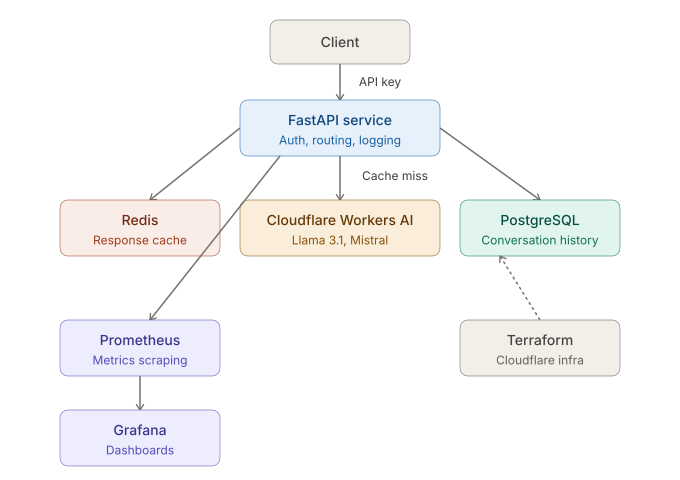
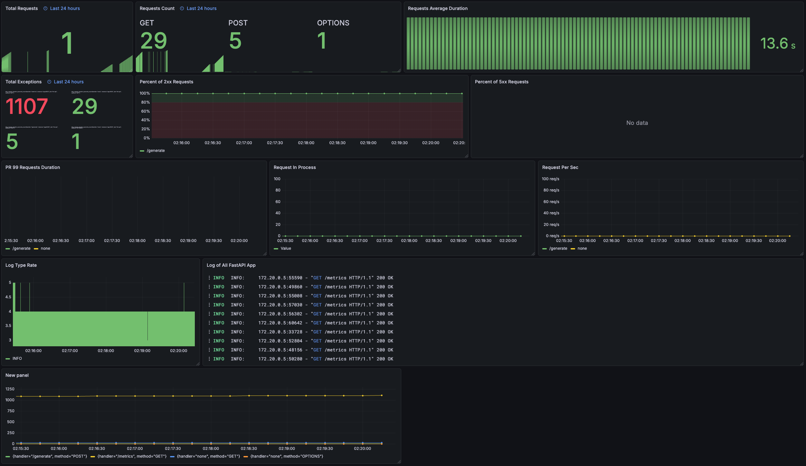

# llm-api
A production-grade LLM API built with Python and FastAPI that proxies prompts to multiple Cloudflare Workers AI models, with streaming, caching, authentication, persistent storage and real-time monitoring.

## How it works
Each request first checks Redis for a cached response. On a cache hit, the answer returns instantly without contacting Cloudflare. On a miss, the prompt is routed to the selected Cloudflare Workers AI model, the response is cached for 5 minutes, and the full exchange is saved to PostgreSQL for history.

## Project Structure
```
app/
├── api/
│   └── routes/     ← endpoints (generate, conversations, models, health)
├── core/           ← config and security
├── services/       ← cache and LLM logic
├── db/             ← models and session
└── schemas/        ← request/response schemas
```

## Architecture


## Monitoring


## Stack
 
 
 
 
 


## Endpoints
- `POST /generate` — Generate text (cached)
- `GET /conversations` — Conversation history
- `GET /models` — Available models
- `GET /health` — Health check

## Quickstart
```bash
cp .env.example .env
# Fill in your Cloudflare credentials and API key in .env
docker compose up
```

## Example
```bash
curl -X POST http://127.0.0.1:8080/generate \
-H "Content-Type: application/json" \
-H "X-API-Key: your-key" \
-d '{"prompt": "Hello!", "model": "llama-3.1-8b"}'
```

## GitHub Secrets
- `CLOUDFLARE_ACCOUNT_ID`
- `CLOUDFLARE_API_TOKEN`
- `API_KEY`
- `DATABASE_URL`